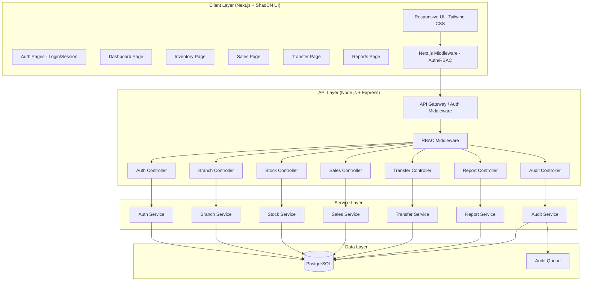
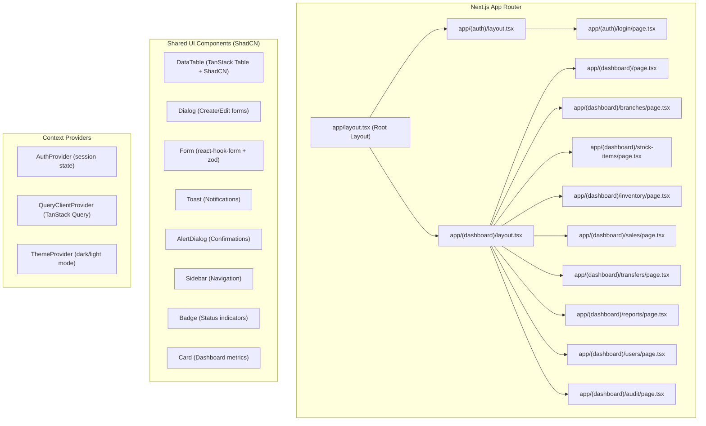
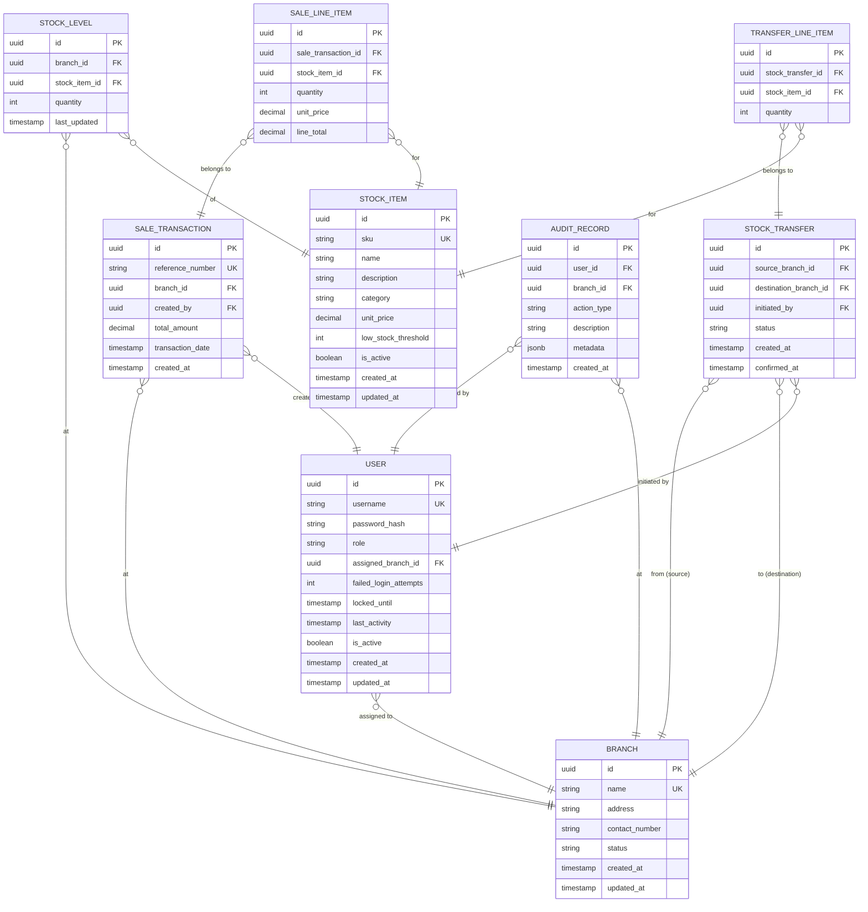
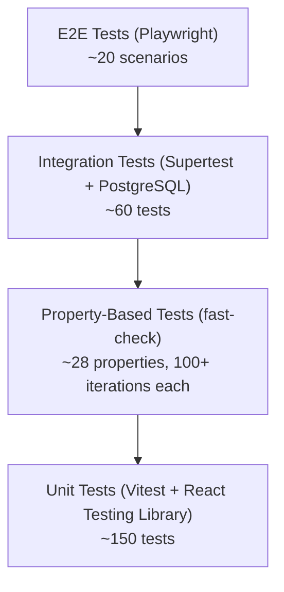

# Technical Design Document

## Multi-Branch Stock Monitoring and Sales Management System

## Overview

This document describes the technical design for a full-stack web application enabling multi-branch stock monitoring and sales management. The system allows businesses with multiple physical locations to track inventory, process sales, transfer stock between branches, and generate reports — all governed by role-based access control.

**Key Design Goals:**
- Atomic inventory operations to prevent stock inconsistencies
- Real-time stock level visibility across branches
- Role-based access enforcement at API and UI layers
- Audit trail for all inventory-affecting operations
- Responsive UI from 320px to 2560px viewports

**Technology Stack:**
- **Frontend:** Next.js 14+ (App Router, React Server Components), ShadCN UI (Radix UI + Tailwind CSS)
- **Backend:** Node.js with Express (REST API), optionally integrated via Next.js API Routes
- **Database:** PostgreSQL (relational, ACID-compliant for transactional integrity)
- **Authentication:** JWT-based with bcrypt password hashing, Next.js Middleware for route protection
- **State Management:** React hooks (useState, useReducer), TanStack Query (React Query) for server state

## Architecture

### High-Level Architecture



### Layered Architecture Pattern

The system follows a strict layered architecture:

1. **Presentation Layer** (Next.js): React Server Components for data fetching, Client Components for interactivity, ShadCN UI for consistent design, Tailwind CSS for responsive layout
2. **Routing & Middleware** (Next.js App Router): File-based routing, middleware for auth/RBAC enforcement at the edge
3. **API Layer** (Express): Route handling, request validation, response formatting
4. **Middleware Layer**: Authentication (JWT verification), Authorization (RBAC)
5. **Service Layer**: Business logic, transaction orchestration, audit logging
6. **Data Access Layer**: Repository pattern over PostgreSQL with connection pooling

### Concurrency Strategy

For stock-affecting operations (sales, transfers), the system uses **pessimistic locking** via PostgreSQL `SELECT ... FOR UPDATE` within database transactions. This ensures:
- No two concurrent sales can oversell the same stock
- Stock transfers are atomic (both source deduction and destination addition succeed or fail together)
- Race conditions on stock levels are eliminated at the database level

## Components and Interfaces

### Frontend Components



**Page/Component Structure:**

```
src/
├── app/
│   ├── layout.tsx                    # Root layout (providers, global styles)
│   ├── (auth)/
│   │   ├── layout.tsx                # Auth layout (centered, no sidebar)
│   │   └── login/page.tsx            # Login page
│   ├── (dashboard)/
│   │   ├── layout.tsx                # Dashboard layout (sidebar + main content)
│   │   ├── page.tsx                  # Dashboard home
│   │   ├── branches/page.tsx         # Branch management
│   │   ├── stock-items/page.tsx      # Stock item management
│   │   ├── inventory/page.tsx        # Inventory monitoring
│   │   ├── sales/
│   │   │   ├── page.tsx              # Sales list
│   │   │   └── new/page.tsx          # Create sale transaction
│   │   ├── transfers/page.tsx        # Stock transfers
│   │   ├── reports/page.tsx          # Reports & export
│   │   ├── users/page.tsx            # User management (Admin)
│   │   └── audit/page.tsx            # Audit trail (Admin)
│   └── api/                          # Optional: Next.js API routes (proxy or standalone)
├── components/
│   ├── ui/                           # ShadCN UI primitives (auto-generated)
│   ├── data-table/                   # Reusable DataTable with sorting, filtering, pagination
│   ├── forms/                        # Domain-specific form components
│   ├── dashboard/                    # Dashboard widgets (cards, charts, alerts)
│   └── layout/                       # Sidebar, header, nav components
├── hooks/                            # Custom React hooks
│   ├── use-auth.ts                   # Authentication hook
│   ├── use-branches.ts               # Branch CRUD hooks (TanStack Query)
│   ├── use-stock-items.ts            # Stock item hooks
│   ├── use-inventory.ts              # Inventory hooks
│   ├── use-sales.ts                  # Sales transaction hooks
│   ├── use-transfers.ts              # Transfer hooks
│   └── use-reports.ts                # Report generation hooks
├── lib/
│   ├── api-client.ts                 # Fetch wrapper with auth headers
│   ├── validators.ts                 # Zod schemas for form validation
│   └── utils.ts                      # Utility functions (cn(), formatters)
├── providers/
│   ├── auth-provider.tsx             # Auth context provider
│   ├── query-provider.tsx            # TanStack Query provider
│   └── theme-provider.tsx            # Theme provider
└── middleware.ts                      # Next.js middleware (auth + RBAC route protection)
```

Each data-heavy page uses the reusable `DataTable` component (built on TanStack Table + ShadCN UI's Table) with server-side data fetching via React Server Components and client-side interactivity for sorting, filtering, and pagination.

### Backend API Endpoints

| Module | Endpoint | Method | Description |
|--------|----------|--------|-------------|
| Auth | `/api/auth/login` | POST | Authenticate user |
| Auth | `/api/auth/logout` | POST | Terminate session |
| Branch | `/api/branches` | GET, POST | List/Create branches |
| Branch | `/api/branches/:id` | GET, PUT, PATCH | Get/Update/Deactivate branch |
| Stock | `/api/stock-items` | GET, POST | List/Create stock items |
| Stock | `/api/stock-items/:id` | GET, PUT | Get/Update stock item |
| Stock | `/api/stock-items/search` | GET | Search stock items |
| Inventory | `/api/inventory/:branchId` | GET | Get stock levels for branch |
| Inventory | `/api/inventory/consolidated/:itemId` | GET | Cross-branch view |
| Inventory | `/api/inventory/alerts` | GET | Get low-stock alerts |
| Sales | `/api/sales` | POST | Create sale transaction |
| Sales | `/api/sales/:branchId` | GET | List sales for branch |
| Transfer | `/api/transfers` | POST | Initiate transfer |
| Transfer | `/api/transfers/:id/confirm` | POST | Confirm transfer |
| Report | `/api/reports/sales` | GET | Generate sales report |
| Report | `/api/reports/stock` | GET | Generate stock report |
| Report | `/api/reports/export` | GET | Export report as CSV |
| Audit | `/api/audit` | GET | Query audit trail |
| Users | `/api/users` | GET, POST | List/Create users |
| Users | `/api/users/:id` | GET, PUT | Get/Update user |
| Users | `/api/users/:id/role` | PUT | Assign role |

### Service Interfaces

```typescript
// Auth Service
interface IAuthService {
  authenticate(username: string, password: string): Promise<AuthResult>;
  validateSession(token: string): Promise<SessionInfo>;
  lockAccount(userId: string): Promise<void>;
  unlockAccount(userId: string): Promise<void>;
}

// Branch Service
interface IBranchService {
  create(data: CreateBranchDto): Promise<Branch>;
  update(id: string, data: UpdateBranchDto): Promise<Branch>;
  deactivate(id: string): Promise<Branch>;
  list(filters?: BranchFilters): Promise<Branch[]>;
  getById(id: string): Promise<Branch>;
}

// Stock Service
interface IStockService {
  createItem(data: CreateStockItemDto): Promise<StockItem>;
  updateItem(id: string, data: UpdateStockItemDto): Promise<StockItem>;
  search(query: string): Promise<StockItem[]>;
  getStockLevel(branchId: string, itemId: string): Promise<StockLevel>;
  getStockLevels(branchId: string): Promise<StockLevel[]>;
  getConsolidatedView(itemId: string): Promise<ConsolidatedStock>;
  getLowStockAlerts(branchId?: string): Promise<LowStockAlert[]>;
}

// Sales Service
interface ISalesService {
  createTransaction(data: CreateSaleDto): Promise<SaleTransaction>;
  getTransactions(branchId: string, filters?: SaleFilters): Promise<SaleTransaction[]>;
  calculateTotal(lineItems: LineItem[]): number;
}

// Transfer Service
interface ITransferService {
  initiate(data: CreateTransferDto): Promise<StockTransfer>;
  confirm(transferId: string): Promise<StockTransfer>;
  getTransfers(branchId: string, filters?: TransferFilters): Promise<StockTransfer[]>;
}

// Report Service
interface IReportService {
  generateSalesReport(filters: SalesReportFilters): Promise<SalesReportData>;
  generateStockReport(filters: StockReportFilters): Promise<StockReportData>;
  exportToCsv(data: ReportData): Promise<Buffer>;
}

// Audit Service
interface IAuditService {
  log(entry: AuditEntry): Promise<void>;
  query(filters: AuditFilters): Promise<AuditRecord[]>;
}
```

### RBAC Middleware

```typescript
// Permission matrix
const ROLE_PERMISSIONS: Record<Role, Permission[]> = {
  Admin: ['*'],  // All permissions, all branches
  Branch_Manager: [
    'inventory:read', 'inventory:write',
    'stock_item:read', 'stock_item:write',
    'transfer:initiate', 'transfer:approve',
    'sales:read',
    'report:read', 'report:export',
    'dashboard:read'
  ],
  Sales_Staff: [
    'sales:create', 'sales:read',
    'inventory:read',
    'dashboard:read'
  ]
};

// Branch-scoped access check
function checkAccess(user: User, permission: string, branchId?: string): boolean {
  if (user.role === 'Admin') return true;
  if (!ROLE_PERMISSIONS[user.role].includes(permission)) return false;
  if (branchId && user.assignedBranchId !== branchId) return false;
  return true;
}
```

## Data Models

### Entity Relationship Diagram



### Key Data Constraints

| Entity | Constraint | Description |
|--------|-----------|-------------|
| USER | `role IN ('Admin', 'Branch_Manager', 'Sales_Staff')` | Exactly three roles |
| USER | `assigned_branch_id NOT NULL` when role is Branch_Manager or Sales_Staff | Branch required for scoped roles |
| BRANCH | `name` unique | No duplicate branch names |
| BRANCH | `status IN ('Active', 'Inactive')` | Binary status |
| STOCK_ITEM | `sku` unique | No duplicate SKUs |
| STOCK_ITEM | `unit_price` between 0.01 and 999999999.99 | Price range |
| STOCK_ITEM | `low_stock_threshold >= 0` | Non-negative threshold |
| STOCK_LEVEL | `(branch_id, stock_item_id)` unique | One level record per item per branch |
| STOCK_LEVEL | `quantity >= 0` | No negative stock |
| SALE_LINE_ITEM | `quantity >= 1` | Minimum one unit |
| SALE_TRANSACTION | At least one line item | Non-empty transactions |
| STOCK_TRANSFER | `source_branch_id != destination_branch_id` | Cannot self-transfer |
| TRANSFER_LINE_ITEM | `quantity` between 1 and 10000 | Transfer quantity range |
| STOCK_TRANSFER | Max 50 line items per transfer | Line item limit |

### Transaction Isolation

Critical operations use PostgreSQL serializable transactions:

```sql
-- Sale Transaction (simplified)
BEGIN;
  -- Lock stock rows for update
  SELECT quantity FROM stock_levels
    WHERE branch_id = $1 AND stock_item_id = ANY($2)
    FOR UPDATE;

  -- Validate all quantities available
  -- Deduct stock
  UPDATE stock_levels SET quantity = quantity - $qty
    WHERE branch_id = $1 AND stock_item_id = $2;

  -- Create sale record
  INSERT INTO sale_transactions ...;
  INSERT INTO sale_line_items ...;
COMMIT;
```

## Correctness Properties

*A property is a characteristic or behavior that should hold true across all valid executions of a system — essentially, a formal statement about what the system should do. Properties serve as the bridge between human-readable specifications and machine-verifiable correctness guarantees.*

### Property 1: Password Validation Correctness

*For any* string, the password validator SHALL accept it if and only if it has 8-128 characters AND contains at least one uppercase letter AND at least one lowercase letter AND at least one numeric digit.

**Validates: Requirements 1.4**

### Property 2: Invalid Credentials Produce Uniform Error

*For any* set of invalid credentials (wrong username, wrong password, or both), the authentication system SHALL return an identical error response that does not distinguish which field was incorrect.

**Validates: Requirements 1.2**

### Property 3: Branch Data Persistence Round-Trip

*For any* valid branch data (name ≤ 100 chars, address ≤ 255 chars, contact ≤ 20 chars, valid status), creating or updating a branch and then retrieving it SHALL return data identical to what was submitted.

**Validates: Requirements 2.1, 2.3**

### Property 4: Branch Validation Rejects Invalid Input

*For any* branch submission where at least one required field is empty or exceeds its maximum length, the system SHALL reject the submission and identify the specific failing field(s).

**Validates: Requirements 2.2**

### Property 5: Branch Name Uniqueness

*For any* existing branch name in the system, attempting to create a new branch with that same name SHALL be rejected.

**Validates: Requirements 2.7**

### Property 6: Deactivated Branch Blocks New Operations

*For any* branch with status "Inactive", the system SHALL reject all new sale transactions and inbound stock transfers targeting that branch.

**Validates: Requirements 2.4**

### Property 7: Stock Item Data Persistence Round-Trip

*For any* valid stock item data (SKU ≤ 30 chars, name ≤ 100 chars, description ≤ 500 chars, category non-empty, price 0.01–999999999.99, threshold ≥ 0), creating or updating the item and retrieving it SHALL return data identical to what was submitted.

**Validates: Requirements 3.1, 3.2**

### Property 8: SKU Uniqueness

*For any* existing SKU in the system, attempting to create or update a stock item to use that SKU SHALL be rejected.

**Validates: Requirements 3.3**

### Property 9: Stock Item Search Completeness

*For any* search query string, all returned stock items SHALL have their SKU, name, or category contain the query string (case-insensitive partial match), and no items matching the query SHALL be excluded from results.

**Validates: Requirements 3.4**

### Property 10: Low-Stock Alert Threshold Invariant

*For any* stock item at any branch, a low-stock alert SHALL exist if and only if the current quantity is strictly below the item's configured low_stock_threshold.

**Validates: Requirements 4.2, 4.3**

### Property 11: Sale Transaction Stock Deduction

*For any* completed sale transaction, the stock level of each line item at the transaction's branch SHALL decrease by exactly the sold quantity (stock_after = stock_before - quantity_sold).

**Validates: Requirements 5.2**

### Property 12: Insufficient Stock Rejects Entire Sale

*For any* sale transaction where at least one line item requests a quantity exceeding the available stock level, the system SHALL reject the entire transaction and leave all stock levels unchanged.

**Validates: Requirements 5.3**

### Property 13: Sale Total Calculation

*For any* set of line items, the transaction total SHALL equal the sum of (quantity × unit_price) for each line item, rounded to exactly two decimal places.

**Validates: Requirements 5.5**

### Property 14: Transaction Reference Uniqueness

*For any* two completed sale transactions, their generated reference numbers SHALL be distinct.

**Validates: Requirements 5.4**

### Property 15: Concurrent Sales Never Oversell Stock

*For any* set of concurrent sale transactions targeting the same stock item at the same branch, the total quantity sold across all successful transactions SHALL NOT exceed the initial stock level.

**Validates: Requirements 5.7**

### Property 16: Stock Transfer Conservation

*For any* confirmed stock transfer, the sum of source branch stock and destination branch stock for each transferred item SHALL remain constant (source_after + dest_after = source_before + dest_before).

**Validates: Requirements 6.2**

### Property 17: Transfer Rejects Insufficient Source Stock

*For any* stock transfer where at least one line item's quantity exceeds the source branch's available stock, the system SHALL reject the entire transfer and leave all stock levels unchanged at both branches.

**Validates: Requirements 6.3**

### Property 18: Transfer Validation Rules

*For any* stock transfer request where source branch equals destination branch, OR the initiator is not assigned to the source branch, OR any line item has quantity ≤ 0, the system SHALL reject the request.

**Validates: Requirements 6.4**

### Property 19: Failed Transfer Preserves Stock Levels

*For any* stock transfer that encounters a system error during confirmation, stock levels at both source and destination branches SHALL remain identical to their pre-transfer values.

**Validates: Requirements 6.6**

### Property 20: Admin Dashboard Aggregation

*For any* set of branch-level metrics, the Admin dashboard totals SHALL equal the sum of corresponding metrics across all active branches.

**Validates: Requirements 7.2**

### Property 21: Report Filter Accuracy

*For any* sales report request with filters (date range, branch, category), every record in the result set SHALL satisfy all specified filter criteria, and no record satisfying all criteria SHALL be excluded.

**Validates: Requirements 7.3**

### Property 22: CSV Export Round-Trip

*For any* displayed report data, exporting to CSV and parsing the CSV SHALL produce a dataset equivalent to the original displayed data.

**Validates: Requirements 7.5**

### Property 23: Role-Permission Enforcement

*For any* user with a given role and any system action, the access control system SHALL grant access if and only if the action is in the role's permission set AND (the user is Admin OR the action's target branch matches the user's assigned branch).

**Validates: Requirements 8.2, 8.3, 8.4, 8.5, 8.6**

### Property 24: Single Role Invariant

*For any* user at any point in time, the user SHALL have exactly one role assigned from the set {Admin, Branch_Manager, Sales_Staff}.

**Validates: Requirements 8.1**

### Property 25: Branch-Scoped Role Requires Branch Assignment

*For any* role assignment of Branch_Manager or Sales_Staff to a user who has no branch assignment, the system SHALL reject the operation.

**Validates: Requirements 8.7**

### Property 26: Audit Record Completeness

*For any* stock adjustment, sale, or transfer operation, the system SHALL produce an audit record containing the user identity, timestamp (second precision), branch identifier, action type, and description with affected item identifiers and quantities.

**Validates: Requirements 9.1**

### Property 27: Audit Query Filter Accuracy

*For any* audit trail query with filters (date range, user, branch, action type), every returned record SHALL match all specified filters, and no matching record SHALL be excluded.

**Validates: Requirements 9.3**

### Property 28: Stock Level Non-Negativity Invariant

*For any* stock-affecting operation (sale, transfer, adjustment), the resulting stock level SHALL never be negative. Any operation that would produce a negative stock level SHALL be rejected.

**Validates: Requirements 5.3, 6.3**

## Error Handling

### Error Classification

| Category | HTTP Code | Handling Strategy |
|----------|-----------|-------------------|
| Validation Error | 400 | Return field-specific errors, no retry |
| Authentication Error | 401 | Clear session, redirect to login |
| Authorization Error | 403 | Display "insufficient permissions" message |
| Not Found | 404 | Display contextual "not found" message |
| Conflict (duplicate) | 409 | Display uniqueness violation message |
| Insufficient Stock | 422 | Display available quantities, no retry |
| Server Error | 500 | Display generic error, log details server-side |
| Service Unavailable | 503 | Display "temporarily unavailable", auto-retry |

### Audit Write Failure Recovery

When an audit record write fails:
1. Retry immediately (attempt 2)
2. Retry after 1 second (attempt 3)
3. Retry after 5 seconds (attempt 4 — final)
4. If all retries fail, enqueue to a persistent dead-letter queue for deferred processing
5. A background worker processes the queue every 60 seconds
6. Audit records are NEVER discarded

### Transaction Failure Recovery

For stock-affecting transactions (sales, transfers):
- PostgreSQL transaction rollback ensures atomicity
- On failure, all stock levels revert to pre-transaction state
- The user receives an error with no partial state changes
- Failed transfers are marked with status "failed" in the database

### Frontend Error Handling

- API errors display toast notifications via ShadCN UI's `<Toast>` component (using `sonner` or `react-hot-toast`)
- Form validation errors display inline below the offending field using `react-hook-form` + Zod schema validation with ShadCN's `<FormMessage>` component
- Network connectivity issues display a persistent `<Alert>` banner at the top of the layout until resolved
- Session expiry triggers Next.js middleware redirect to `/login` with a "session expired" search param displayed as a toast

## Testing Strategy

### Testing Pyramid



### Property-Based Testing (fast-check)

The system uses [fast-check](https://github.com/dubzzz/fast-check) for property-based testing in TypeScript/JavaScript.

**Configuration:**
- Minimum 100 iterations per property test
- Each test tagged with: `Feature: multi-branch-stock-sales-system, Property {N}: {title}`
- Custom arbitraries (generators) for domain objects: Branch, StockItem, User, LineItem, Transfer

**Key Test Suites:**

| Suite | Properties Covered | Focus |
|-------|-------------------|-------|
| `password-validation.property.spec.ts` | P1 | Password rule enforcement |
| `auth-error.property.spec.ts` | P2 | Uniform error responses |
| `branch-persistence.property.spec.ts` | P3, P4, P5, P6 | Branch CRUD and validation |
| `stock-item.property.spec.ts` | P7, P8, P9 | Item CRUD, SKU uniqueness, search |
| `inventory-alerts.property.spec.ts` | P10 | Alert threshold invariant |
| `sales-transaction.property.spec.ts` | P11, P12, P13, P14, P15 | Sale processing, stock deduction, totals |
| `stock-transfer.property.spec.ts` | P16, P17, P18, P19 | Transfer atomicity and validation |
| `reporting.property.spec.ts` | P20, P21, P22 | Dashboard aggregation, filters, CSV export |
| `rbac.property.spec.ts` | P23, P24, P25 | Role enforcement and invariants |
| `audit.property.spec.ts` | P26, P27 | Audit completeness and query accuracy |
| `stock-invariants.property.spec.ts` | P28 | Non-negativity invariant |

### Unit Tests (Vitest + React Testing Library)

Focus areas:
- React component rendering and user interaction (React Testing Library)
- Specific edge cases (empty transaction, zero quantity, account lockout timing)
- Error condition handling (export failure, network timeout)
- Input boundary values (max lengths, min/max prices)
- Date range calculations for reports
- Session timeout behavior
- Custom hook behavior (TanStack Query hooks with mock responses)
- Form validation with Zod schemas

### Integration Tests (Supertest + PostgreSQL)

Focus areas:
- Full API endpoint request/response cycles
- Database transaction behavior under concurrent access
- Authentication flow (login, session, logout)
- Next.js middleware auth/RBAC enforcement
- Responsive layout breakpoints (320px, 767px, 768px, 1024px, 2560px) via Playwright viewport testing

### End-to-End Tests (Playwright)

Focus areas:
- Complete sales workflow (login → search item → create sale → verify stock update)
- Stock transfer workflow (initiate → confirm → verify both branches)
- Report generation and CSV export
- Role-based navigation visibility
- Account lockout and recovery flow
- Cross-browser testing (Chromium, Firefox, WebKit)
- Mobile viewport testing for responsive layout

### Test Data Strategy

- **Generators (fast-check arbitraries):** Random valid/invalid branches, stock items, users, transactions, transfers
- **Fixtures:** Seeded database state for integration tests
- **Factories:** Consistent test data builders for unit tests
